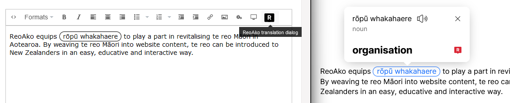
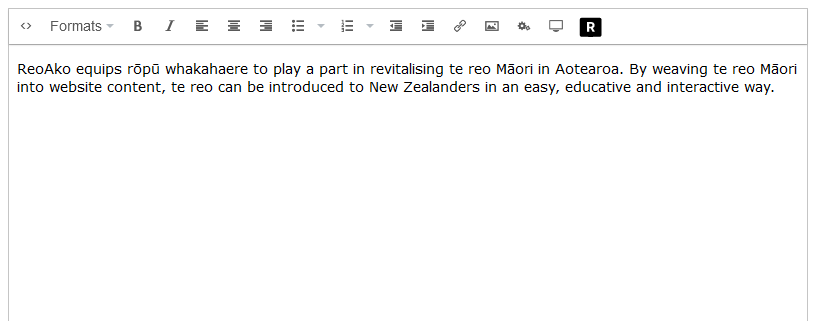
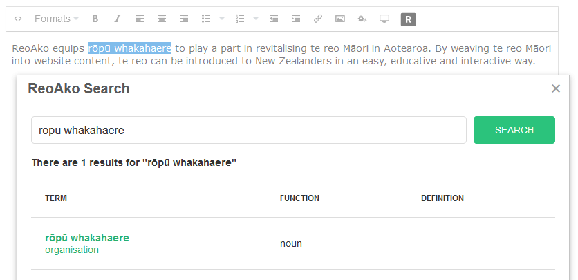
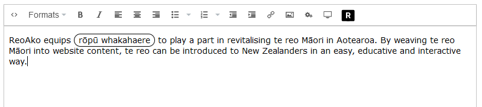
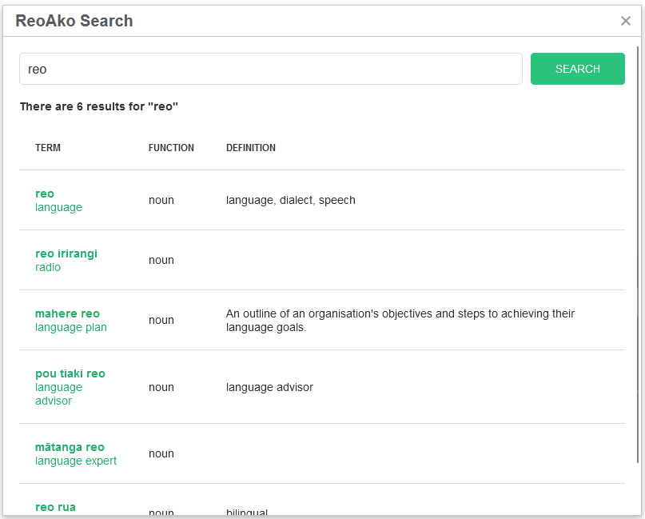

# ReoAko Umbraco TinyMCE Plugin

The <a href="https://www.reoako.nz/" target="_blank">ReoAko</a> Umbraco plugin integrates with the ReoAko API. ReoAko helps content editors to use te reo Māori correctly, in the right context, and support your readers with word definitions and pronunciation.



## Requirements

- Umbraco 10+
- ReoAko API key - see <a href="https://www.reoako.nz/" target="_blank">reoako.nz</a> for more info

---

## Installation

### NuGet package installation

Install the NuGet package `BornDigital.ReoAko.Umbraco` either from the NuGet Package Manager or the command line:  
`dotnet add package BornDigital.ReoAko.Umbraco`

### App settings

Add the following to your `appsettings.json`:

1. Within `Umbraco:CMS` add the `RichTextEditor` section that adds the `reoakotranslationdialog` plugin.

```

  "Umbraco": {
    "CMS": {
      // other sections removed for legibility
      "RichTextEditor": {
        "Plugins": [
          "reoakotranslationdialog"
        ],
        "Commands": [
          {
            "Alias": "reoakotranslationdialog",
            "Name": "ReoAko",
            "Mode": "Selection"
          }
        ]
      }
    }
  },
```

2. Add a section `ReoAko` with your ReoAko API Key assigned to `ApiKey`

```
  "ReoAko": {
    "ApiKey": "xxxxxxxxxxxxxx" // replace with your ReoAko API key
  }
```

### Startup

In your `Startup.cs`, in the  `ConfigureServices` method, invoke the `AddReoAkoServices` extension method, passing in your configuration. This requires a reference to `using BornDigital.ReoAko.Umbraco;`

```
        public void ConfigureServices(IServiceCollection services)
        {
            services.AddUmbraco(_env, _config)
                .AddBackOffice()
                .AddWebsite()
                .AddComposers()
                .Build();

            services.AddReoAkoServices(_config);
        }
```

### TinyMCE styles

This is optional, but recommended to give editors a visual clue that a ReoAko definition has been applied to text. It adds styling to the `span` with the class `.reoako-term` that the plugin uses.

If you are already using formats for the TinyMCE, you should have a stylesheet file in `/wwwroot/css/`. If you do not have one there, create a file, eg `/wwwroot/css/rte.css`.  
Add the following - this one mimics the default frontend style, but you can edit this style to your liking:

```
span.reoako-term {
    border-radius: 9999px;
    border: .085em solid;
    padding: .05em .5em .15em;
}
```

### Enabling the plugin for the TinyMCE editor

1. Start your site and log in to the Umbraco backoffice
2. Go to `Settings` > `Data Types` > `Richtext editor`
3. Under `Toolbar` enable the new checkbox for `ReoAko`
4. If you have just created a new stylesheet (see above), ensure it is selected under `Stylesheets`.
5. Repeat for any other `Rich Text Editor` data types you have created
6. Repeat for any `Grid layout` data types you are using

## Frontend setup

For the frontend of your website to display the ReoAko definitions, use <a href="https://www.npmjs.com/package/@octavenz/reoako" target="_blank">https://www.npmjs.com/package/@octavenz/reoako</a>.  
You can integrate theis package with your build process.

**Quick start:**  
Copy `reoako.css` and `reoako.umd.js` and initialise it with your API key - see NPM package for details.

```
<script src="/js/reoako.umd.js"></script>
<script>
    reoako.init({
        apiKey: 'xxxxxxxxxxxxxx',
    });
</script>
```

---

## Usage

Once you have completed the installation above, you will see a new ReoAko button in the Rich Text Editor:



Clicking the ReoAko button when text is selected will search for the highlighted text. You can also click the button without highlighting text and type in the search field.



Clicking a result will insert it into the text editor. If you have set a style for `span.reoako-term`, you will get a visual clue that the word definition has been applied.



You may get multiple results, ensure to select the correct one.



---

## Acknowledgements

* TinyMCE plugin based on Silverstripe plugin developed by OctaveNZ: https://github.com/octavenz/silverstripe-reoako
* Sample text taken from https://www.reoako.nz/features
